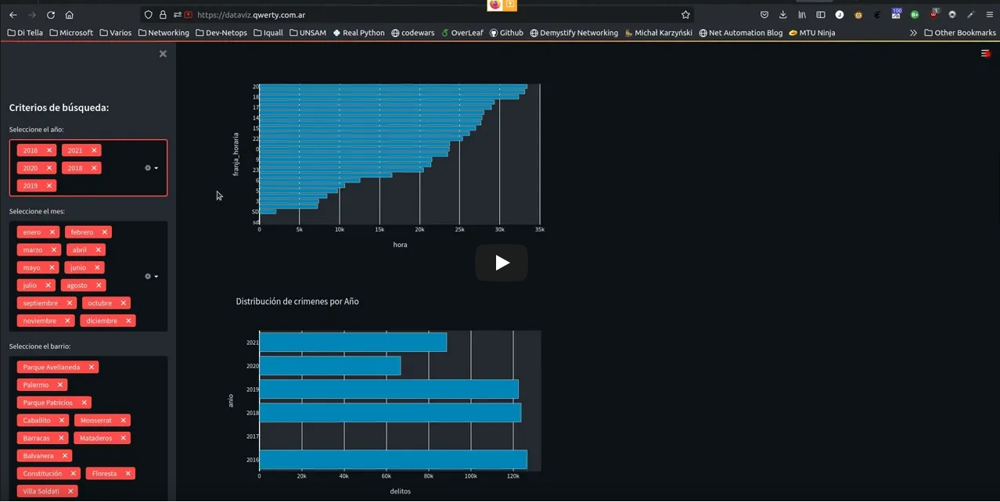

# ditella-data-viz

Execute only script or webserver with streamlit

```
make run: Execute standard script in order to generate graphs
make webserver: Execute streamlit project
```

Example of streamlit project can be found at https://dataviz.qwerty.com.ar
[](https://www.youtube.com/watch?v=xWiXpkexwDw)

